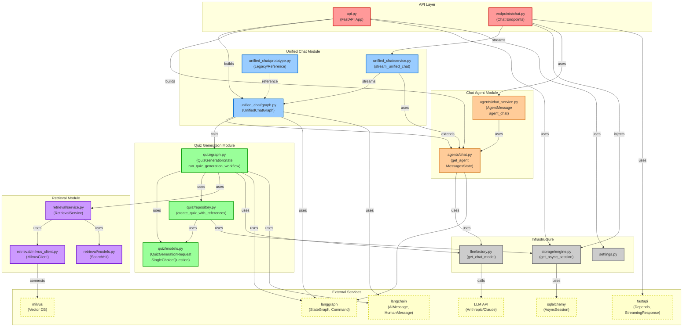

# Quiz Generation Agent & Unified Chat - Module Dependency Graph

## Architecture Overview

This document describes the module dependencies for the quiz generation agent and unified chat system, following LangGraph best practices.

## Dependency Diagram



## Key Data Flows

### 1. Quiz Generation Flow

```
API Request
    ↓
quiz/graph.py (run_quiz_generation_workflow)
    ↓
retrieval/service.py (retrieve_relevant_chunks)
    ↓
Milvus (hybrid_search)
    ↓
quiz/graph.py (generate_questions node)
    ↓
LLM (generate quiz questions)
    ↓
quiz/repository.py (create_quiz_with_references)
    ↓
Database (persist quizzes)
    ↓
Response with quiz_ids
```

### 2. Unified Chat Flow

```
POST /unified-chat
    ↓
unified_chat/service.py (stream_unified_chat)
    ↓
unified_chat/graph.py (intent_router_node)
    ↓
    ├─→ chat_agent → agents/chat.py → LLM
    │
    └─→ quiz_agent → quiz/graph.py → [retrieval + LLM + DB]
```

### 3. Runtime Dependencies (via config)

```
┌─────────────────────────────────────────────────────────┐
│  Graph Build Time (app startup):                        │
│  - checkpointer (AsyncPostgresSaver) - long-lived       │
│  - chat_agent (CompiledStateGraph) - long-lived         │
│  - unified_chat_graph (CompiledStateGraph) - long-lived │
└─────────────────────────────────────────────────────────┘
                           │
                           ▼
┌─────────────────────────────────────────────────────────┐
│  Request Time (per HTTP request):                       │
│  - session (via Depends) → config["configurable"]       │
│  - chat_agent → config["configurable"]                  │
│  - user_id, thread_id → config                          │
└─────────────────────────────────────────────────────────┘
```

## Module Summary

| Module | Purpose | Dependencies |
|--------|---------|--------------|
| `quiz/graph.py` | LangGraph workflow for quiz generation | retrieval, llm, quiz/models, langgraph |
| `quiz/models.py` | Pydantic models for quiz (request/response) | pydantic |
| `quiz/repository.py` | Database CRUD operations for quizzes | storage, quiz/models |
| `unified_chat/graph.py` | Intent routing + multi-agent coordination | agents/chat, quiz/graph, langgraph |
| `unified_chat/service.py` | Streaming service for unified chat (SSE) | unified_chat/graph, agents/chat |
| `agents/chat.py` | Chat agent with checkpointing support | llm, langgraph |
| `retrieval/service.py` | RAG service for Milvus vector search | retrieval/milvus_client |
| `retrieval/milvus_client.py` | Milvus client for hybrid search | pymilvus |

## LangGraph Best Practices Applied

### 1. Command Pattern
All nodes return `Command(update=..., goto=...)` for explicit routing:

```python
# quiz/graph.py
async def retrieve_chunks(state: QuizGenerationState) -> Command[Literal["generate_questions"]]:
    # ... logic ...
    return Command(
        update={"context_chunks": hits, "messages": [status_msg]},
        goto="generate_questions",
    )
```

### 2. State Management
State uses `Annotated[list[AnyMessage], add]` for message accumulation:

```python
class QuizGenerationState(TypedDict):
    messages: Annotated[list[AnyMessage], add]  # Appends, not replaces
    doc_id: int | None
    topic: str | None
    count: int | None
    context_chunks: list[SearchHit]
    generated_questions: list[SingleChoiceQuestion]
    quiz_ids: list[int]
```

### 3. Graph-Level Streaming
Streaming is done at graph boundary using `graph.astream()`:

```python
# unified_chat/service.py
async for mode, chunk in unified_graph.astream(
    initial_state,
    stream_mode=["updates", "messages"],
    config=config,
):
    # Handle tokens and state updates
```

### 4. Runtime Dependencies via Config
Short-lived resources (session) passed via config at runtime:

```python
# Build time
app.state.unified_chat_graph = build_unified_chat_graph(checkpointer)

# Request time
config["configurable"]["session"] = session  # Injected via Depends
config["configurable"]["chat_agent"] = chat_agent  # From app.state
```

## File Structure

```
eduagent/
├── api/
│   ├── api.py                          # FastAPI app with lifespan
│   └── endpoints/
│       └── chat.py                     # /unified-chat endpoint
├── agents/
│   ├── chat.py                         # Chat agent with checkpointer
│   └── chat_service.py                 # AgentMessage and streaming
├── quiz/
│   ├── graph.py                        # Quiz generation LangGraph workflow
│   ├── models.py                       # Pydantic models (request/response)
│   └── repository.py                   # Database CRUD operations
├── unified_chat/
│   ├── graph.py                        # Intent routing + multi-agent graph
│   ├── service.py                      # Streaming service for unified chat
│   └── prototype.py                    # Legacy reference implementation
├── retrieval/
│   ├── service.py                      # RAG service
│   ├── milvus_client.py                # Milvus hybrid search client
│   └── models.py                       # SearchHit model
├── storage/
│   └── engine.py                       # Database engine and session factory
└── llm/
    └── factory.py                      # LLM client factory
```

## Related Documentation

- [LangGraph Best Practices](../langgraph/)
- [Streaming Guide](../langgraph/streaming.md)
- [Quiz Schema](./quiz-schema.md)
